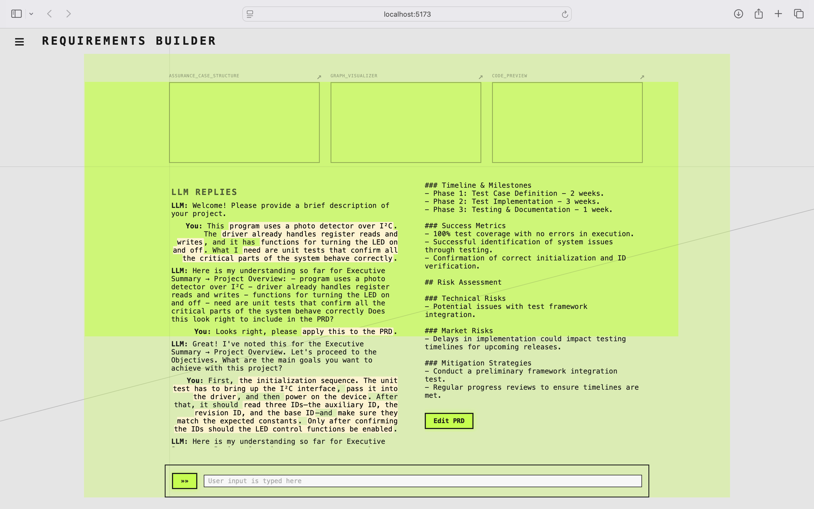
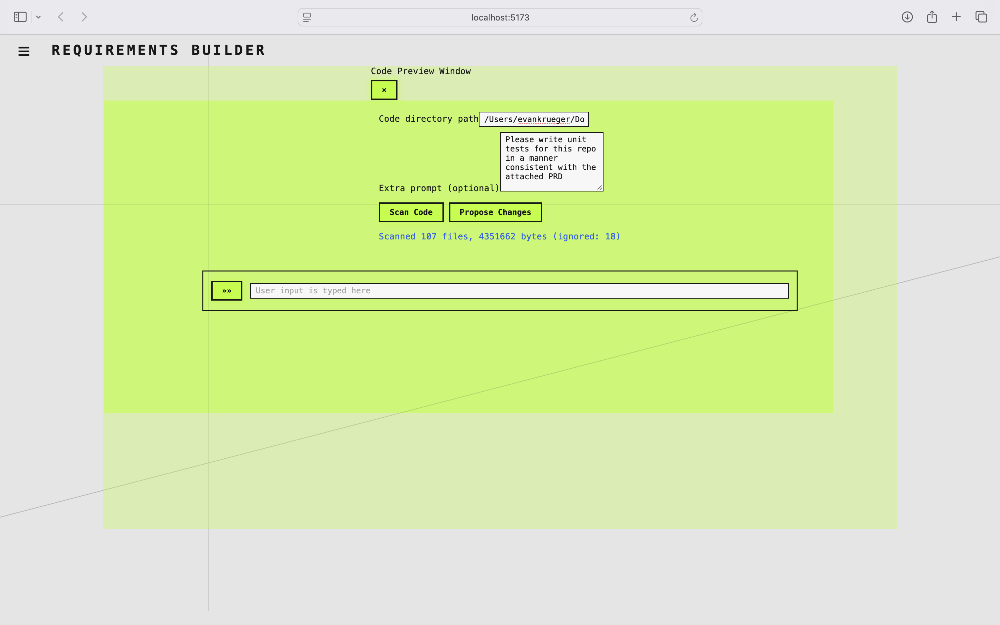

### LLM-assisted Product Requirements Document + Unit Test Generation

This is a demonstration of the PRD and unit test generation using the PulsePatch Proxy project (the same one used with the hardware-in-the-loop APR) as a case study. 
A more in-depth description of the process can be found with the code in the "spec-builder" repository.

### Conversation

The process starts by having a conversation with the LLM about what the project is expected to do.
This is an iterative conversation, a screenshot of which can be found below.

The full conversation that was carried out as part of this demonstration can be found in `CONVO.md`.
At the end of the conversation, the tool generates a product requirements document.
For our scenario, that can be found in `PRD.md`.

### Unit Tests

Once the PRD document is create, that can be combined with an existing code base to generate a starting point for unit tests.
The interface for doing so can be seen in the screenshot below:

Given the PRD generated from the description of the PulsePatch problem and access to the code base -- included as part of the HIL APR demonstration -- the tool was able to generate a handful of unit tests, found in `generated_unit_tests.c`.
The tests can be, with minor modification, dropped into the test harness used for the hardware-in-the-loop APR evaluation.
They are similar to the unit tests that were created by hand for the APR evaluation.